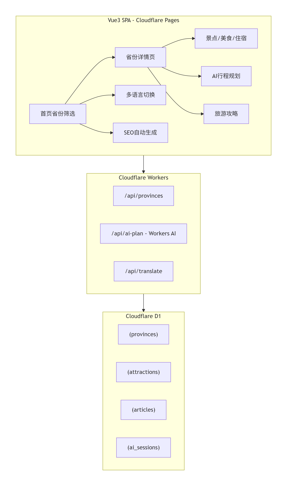

一、项目总览与架构




核心亮点：

完全基于 Cloudflare 全球网络，零服务器成本启动

AI 行程规划使用 Workers AI 或兼容 OpenAI 的模型

多语言通过 Workers 实时翻译并缓存至 D1

SEO 自动化生成多语言 sitemap 与结构化数据

广告位预留 Google AdSense 与联盟营销

二、项目目录结构
```
sino-trip-ai/
├── public/
│   ├── favicon.ico
│   └── _headers                 # Cloudflare Pages 头配置
├── src/
│   ├── assets/                  # 图片、图标
│   ├── components/
│   │   ├── SeoHead.vue          # SEO Meta 动态组件
│   │   ├── ProvinceCard.vue
│   │   ├── AiChat.vue           # AI 对话组件
│   │   ├── AdBanner.vue         # 广告位
│   │   └── MapView.vue          # 地图组件
│   ├── composables/
│   │   ├── useSeo.ts            # SEO 逻辑
│   │   ├── useI18n.ts           # 多语言切换
│   │   └── useApi.ts            # 统一 fetch 封装
│   ├── locales/
│   │   ├── zh-CN.json
│   │   ├── en.json
│   │   └── ja.json
│   ├── pages/
│   │   ├── HomePage.vue         # 首页：省份网格
│   │   ├── ProvincePage.vue     # 省份详情
│   │   ├── ArticlePage.vue      # 攻略文章
│   │   ├── AiPlanPage.vue       # AI 行程规划页
│   │   └── NotFound.vue
│   ├── router/
│   │   └── index.ts
│   ├── stores/                  # Pinia 状态管理
│   │   ├── province.ts
│   │   └── i18n.ts
│   ├── App.vue
│   ├── main.ts
│   └── style.css
├── functions/                   # Cloudflare Pages Functions (Worker)
│   ├── api/
│   │   ├── provinces.ts         # GET /api/provinces
│   │   ├── province/[id].ts     # GET /api/province/:id
│   │   ├── ai-plan.ts           # POST /api/ai-plan
│   │   ├── translate.ts         # POST /api/translate
│   │   └── sitemap.ts           # GET /sitemap.xml
│   └── _middleware.ts           # 跨域、缓存控制
├── wrangler.toml
├── package.json
├── vite.config.ts
├── tsconfig.json
└── README.md
```
---

三、关键配置文件
1. wrangler.toml

```
name = "travel-planet"
pages_build_output_dir = "dist"
compatibility_date = "2025-05-31"

[[d1_databases]]
binding = "DB"
database_name = "travel-planet-db"
database_id = "your-database-id"

[ai]
binding = "AI"
```

2. package.json（核心依赖）
```
{
  "name": "travel-planet",
  "version": "1.0.0",
  "scripts": {
    "dev": "vite",
    "build": "vue-tsc && vite build",
    "preview": "wrangler pages dev dist",
    "deploy": "wrangler pages deploy dist"
  },
  "dependencies": {
    "vue": "^3.4",
    "vue-router": "^4",
    "pinia": "^2",
    "vue-i18n": "^9",
    "leaflet": "^1.9",
    "marked": "^12"
  },
  "devDependencies": {
    "@vitejs/plugin-vue": "^5",
    "vite": "^5",
    "wrangler": "^3",
    "typescript": "^5",
    "vue-tsc": "^2"
  }
}
```
3. vite.config.ts
```
import { defineConfig } from 'vite'
import vue from '@vitejs/plugin-vue'

export default defineConfig({
  plugins: [vue()],
  server: {
    proxy: {
      '/api': 'http://localhost:8788'  // 本地 Workers 调试
    }
  }
})
```
四、D1 数据库设计 SQL
```
-- 省份表
CREATE TABLE provinces (
  id TEXT PRIMARY KEY,
  name_zh TEXT NOT NULL,
  name_en TEXT,
  slug TEXT UNIQUE,
  description_zh TEXT,
  image_url TEXT,
  latitude REAL,
  longitude REAL,
  created_at DATETIME DEFAULT CURRENT_TIMESTAMP
);

-- 景点表
CREATE TABLE attractions (
  id TEXT PRIMARY KEY,
  province_id TEXT REFERENCES provinces(id),
  name_zh TEXT,
  name_en TEXT,
  category TEXT,  -- 'nature','culture','food'
  description_zh TEXT,
  image_url TEXT,
  latitude REAL,
  longitude REAL,
  rating REAL DEFAULT 4.5
);

-- 攻略文章表
CREATE TABLE articles (
  id TEXT PRIMARY KEY,
  province_id TEXT REFERENCES provinces(id),
  title_zh TEXT,
  content_zh TEXT,
  author TEXT,
  published_at DATETIME,
  seo_keywords TEXT
);

-- AI 对话缓存
CREATE TABLE ai_sessions (
  id TEXT PRIMARY KEY,
  user_id TEXT,
  messages TEXT,  -- JSON
  plan_result TEXT,
  created_at DATETIME
);

-- 初始化省份数据示例
INSERT INTO provinces VALUES
('yn','云南','Yunnan','yunnan','彩云之南，旅游天堂','https://images.unsplash.com/...',25.04,102.7),
('sc','四川','Sichuan','sichuan','天府之国，熊猫故乡','https://images.unsplash.com/...',30.57,104.06);
```
五、Vue3 页面核心实现
1. 路由配置 router/index.ts
```
import { createRouter, createWebHistory } from 'vue-router'

const routes = [
  {
    path: '/',
    name: 'home',
    component: () => import('../pages/HomePage.vue')
  },
  {
    path: '/province/:slug',
    name: 'province',
    component: () => import('../pages/ProvincePage.vue'),
    props: true
  },
  {
    path: '/article/:id',
    name: 'article',
    component: () => import('../pages/ArticlePage.vue')
  },
  {
    path: '/ai-plan',
    name: 'aiPlan',
    component: () => import('../pages/AiPlanPage.vue')
  },
  {
    path: '/:pathMatch(.*)*',
    name: 'notFound',
    component: () => import('../pages/NotFound.vue')
  }
]

export default createRouter({
  history: createWebHistory(),
  routes,
  scrollBehavior() {
    return { top: 0 }
  }
})

```
2. 首页 pages/HomePage.vue
```
<template>
  <SeoHead :title="$t('home.title')" :description="$t('home.desc')" />
  <div class="home-container">
    <header class="hero">
      <h1>{{ $t('home.hero') }}</h1>
      <div class="search-bar">
        <input v-model="search" :placeholder="$t('home.searchPlaceholder')" />
      </div>
    </header>

    <section class="provinces-grid">
      <ProvinceCard
        v-for="province in filteredProvinces"
        :key="province.id"
        :province="province"
      />
    </section>

    <AdBanner slot="bottom" />
  </div>
</template>

<script setup lang="ts">
import { ref, computed } from 'vue'
import { useProvinceStore } from '../stores/province'
import ProvinceCard from '../components/ProvinceCard.vue'
import SeoHead from '../components/SeoHead.vue'
import AdBanner from '../components/AdBanner.vue'
import { useI18n } from 'vue-i18n'

const { t } = useI18n()
const store = useProvinceStore()
store.fetchProvinces()  // 调用 /api/provinces

const search = ref('')
const filteredProvinces = computed(() =>
  store.provinces.filter(p =>
    p.name_zh.includes(search.value) || p.name_en?.includes(search.value)
  )
)
</script>
```
3. 省份详情页 pages/ProvincePage.vue
```
<template>
  <SeoHead :title="province?.name_zh" :description="province?.description_zh" />
  <div v-if="province" class="province-page">
    
    <h1>{{ province.name_zh }}</h1>
    <p>{{ province.description_zh }}</p>

    <MapView :center="[province.latitude, province.longitude]" :markers="attractions" />

    <section>
      <h2>{{ $t('province.attractions') }}</h2>
      <div class="card-list">
        <div v-for="attr in attractions" :key="attr.id" class="attr-card">
          <h3>{{ attr.name_zh }}</h3>
          <span>⭐ {{ attr.rating }}</span>
        </div>
      </div>
    </section>

    <div class="ai-entry">
      <router-link :to="`/ai-plan?province=${province.slug}`" class="btn-primary">
        {{ $t('province.aiPlan') }}
      </router-link>
    </div>

    <AdBanner />
  </div>
</template>

<script setup lang="ts">
import { ref, onMounted } from 'vue'
import { useRoute } from 'vue-router'
import { useApi } from '../composables/useApi'
import MapView from '../components/MapView.vue'

const route = useRoute()
const province = ref(null)
const attractions = ref([])

onMounted(async () => {
  const data = await useApi(`/api/province/${route.params.slug}`)
  province.value = data.province
  attractions.value = data.attractions
})
</script>
```
4. AI 行程规划页 pages/AiPlanPage.vue
```
<template>
  <SeoHead :title="$t('aiPlan.title')" />
  <div class="ai-plan">
    <h1>AI 旅游规划助手</h1>
    <div class="chat-box" ref="chatBox">
      <div v-for="(msg, i) in messages" :key="i" :class="msg.role">
        <span v-if="msg.role==='assistant'" class="avatar">🤖</span>
        <div class="bubble" v-html="renderMarkdown(msg.content)"></div>
      </div>
    </div>
    <div class="input-area">
      <input v-model="userInput" @keyup.enter="sendMessage" :placeholder="$t('aiPlan.placeholder')" />
      <button @click="sendMessage" :disabled="loading">{{ $t('aiPlan.send') }}</button>
    </div>
  </div>
</template>

<script setup lang="ts">
import { ref, nextTick, watch } from 'vue'
import { marked } from 'marked'

const messages = ref([
  { role: 'assistant', content: '你好！告诉我你想去哪个省份、旅行天数、预算和兴趣，我为你生成专属行程。' }
])
const userInput = ref('')
const loading = ref(false)
const chatBox = ref<HTMLElement>()

async function sendMessage() {
  if (!userInput.value.trim() || loading.value) return
  messages.value.push({ role: 'user', content: userInput.value })
  userInput.value = ''
  loading.value = true
  await nextTick(); scrollToBottom()

  try {
    const res = await fetch('/api/ai-plan', {
      method: 'POST',
      headers: { 'Content-Type': 'application/json' },
      body: JSON.stringify({
        messages: messages.value.slice(-6), // 保留上下文
        province: new URLSearchParams(location.search).get('province')
      })
    })
    const data = await res.json()
    messages.value.push({ role: 'assistant', content: data.reply })
  } catch (e) {
    messages.value.push({ role: 'assistant', content: '服务暂时不可用，请稍后重试。' })
  } finally {
    loading.value = false
    await nextTick(); scrollToBottom()
  }
}

function scrollToBottom() {
  chatBox.value?.scrollTo(0, chatBox.value.scrollHeight)
}
function renderMarkdown(text: string) {
  return marked(text)
}
</script>
```
5. SEO 动态头组件 components/SeoHead.vue
```
<script setup lang="ts">
import { useHead } from '@vueuse/head' // 或手动操作 document.head
import { computed } from 'vue'

const props = defineProps<{
  title?: string
  description?: string
  image?: string
  type?: string
}>()

const fullTitle = computed(() => `${props.title || '中国旅游攻略'} - Travel Planet`)
useHead({
  title: fullTitle.value,
  meta: [
    { name: 'description', content: props.description || '探索中国最美省份，获取AI定制行程' },
    { property: 'og:title', content: fullTitle.value },
    { property: 'og:description', content: props.description },
    { property: 'og:image', content: props.image || '/default-og.jpg' },
    { property: 'og:type', content: props.type || 'website' }
  ],
  script: [
    {
      type: 'application/ld+json',
      children: JSON.stringify({
        '@context': 'https://schema.org',
        '@type': 'TouristDestination',
        name: props.title,
        description: props.description
      })
    }
  ]
})
</script>

<template>
  <!-- 无视觉输出 -->
</template>
```
六、Cloudflare Workers API 实现
1. 获取省份列表 functions/api/provinces.ts
```
export const onRequestGet: PagesFunction<{ DB: D1Database }> = async ({ env }) => {
  const { results } = await env.DB.prepare('SELECT * FROM provinces').all()
  return Response.json(results)
}
```
2. AI 行程规划 functions/api/ai-plan.ts
```
export const onRequestPost: PagesFunction<{ AI: any }> = async ({ request, env }) => {
  const { messages, province } = await request.json()
  
  const systemPrompt = `你是一位中国旅游规划专家。用户计划去${province || '中国'}旅游。请根据对话生成详细的每日行程，包括景点、美食推荐、交通建议，使用Markdown格式。`
  
  const chat = [
    { role: 'system', content: systemPrompt },
    ...messages
  ]

  try {
    const response = await env.AI.run('@cf/meta/llama-3-8b-instruct', {
      messages: chat,
      stream: false
    })
    return Response.json({ reply: response.response })
  } catch (e) {
    // 降级到模拟回复
    return Response.json({ reply: "## 模拟行程\n**Day 1**: 抵达后游览..." })
  }
}
```
3. 多语言翻译缓存 functions/api/translate.ts
```
export const onRequestPost: PagesFunction<{ DB: D1Database }> = async ({ request, env }) => {
  const { text, targetLang } = await request.json()
  
  // 1. 查缓存
  const cached = await env.DB.prepare(
    'SELECT translated FROM translations WHERE source_text = ? AND lang = ?'
  ).bind(text, targetLang).first()
  
  if (cached) return Response.json({ translated: cached.translated })

  // 2. 调用 Workers AI 翻译
  const ai = env.AI
  const result = await ai.run('@cf/meta/m2m100-1.2b', {
    text,
    source_lang: 'zh',
    target_lang: targetLang
  })

  // 3. 存入缓存
  await env.DB.prepare(
    'INSERT INTO translations (source_text, lang, translated) VALUES (?, ?, ?)'
  ).bind(text, targetLang, result.translated).run()

  return Response.json({ translated: result.translated })
}
```
七、多语言实现（前端）
在 main.ts 中挂载 vue-i18n：

```
import { createI18n } from 'vue-i18n'
import zh from './locales/zh-CN.json'
import en from './locales/en.json'

const i18n = createI18n({
  legacy: false,
  locale: 'zh-CN',
  fallbackLocale: 'zh-CN',
  messages: { 'zh-CN': zh, en }
})

app.use(i18n)
```
语言切换组件可放在导航栏，切换时同步修改 HTML lang 属性并触发动态翻译。

八、地图系统集成（Leaflet + OpenStreetMap）
components/MapView.vue：

```
<template>
  <div ref="mapContainer" class="map"></div>
</template>

<script setup>
import { ref, onMounted, watch } from 'vue'
import L from 'leaflet'
import 'leaflet/dist/leaflet.css'

const props = defineProps({
  center: { type: Array, default: () => [35, 105] },
  markers: { type: Array, default: () => [] }
})

const mapContainer = ref(null)
let map

onMounted(() => {
  map = L.map(mapContainer.value).setView(props.center, 6)
  L.tileLayer('https://{s}.tile.openstreetmap.org/{z}/{x}/{y}.png', {
    attribution: '&copy; OpenStreetMap contributors'
  }).addTo(map)

  props.markers.forEach(m => {
    L.marker([m.latitude, m.longitude]).addTo(map).bindPopup(m.name_zh)
  })
})

watch(() => props.center, (val) => {
  map?.setView(val, 6)
})
</script>

<style scoped>
.map { height: 400px; width: 100%; }
</style>
```
九、商业化广告组件 components/AdBanner.vue
```
<template>
  <div class="ad-container">
    <!-- Google AdSense 代码 -->
    <ins class="adsbygoogle"
         style="display:block"
         data-ad-client="ca-pub-XXXXXXXXXXXXXXXX"
         data-ad-slot="1234567890"
         data-ad-format="auto"></ins>
    <p class="ad-label">广告</p>
  </div>
</template>

<script setup>
onMounted(() => {
  try {
    (window.adsbygoogle = window.adsbygoogle || []).push({})
  } catch (e) { console.log('AdSense not loaded') }
})
</script>

```
十、部署与 SEO 自动化
1. Cloudflare Pages 部署
在项目根目录运行：

```
npx wrangler pages deploy dist --project-name=travel-planet

```

确保 wrangler.toml 中的 D1 数据库和 AI 绑定已正确配置，并已在 Cloudflare Dashboard 创建 D1 数据库和启用 Workers AI。

2. 自动生成多语言 Sitemap
创建 functions/sitemap.xml.ts 动态生成 sitemap：

```
export const onRequestGet: PagesFunction<{ DB: D1Database }> = async ({ env }) => {
  const provinces = await env.DB.prepare('SELECT slug FROM provinces').all()
  const urls = provinces.results.map(p => `
    <url>
      <loc>https://travel-planet.pages.dev/province/${p.slug}</loc>
      <changefreq>weekly</changefreq>
    </url>`).join('')

  const xml = `<?xml version="1.0" encoding="UTF-8"?>
    <urlset xmlns="http://www.sitemaps.org/schemas/sitemap/0.9">
      <url><loc>https://travel-planet.pages.dev/</loc></url>
      ${urls}
    </urlset>`
    
  return new Response(xml, {
    headers: { 'Content-Type': 'application/xml' }
  })
}

```
在 public/_headers 中设置缓存规则：

```
/sitemap.xml
  Cache-Control: public, max-age=3600

```
十一、AI Agent 升级路线
当前实现是简单的请求-回复，未来可扩展为：

多步骤 Agent：Workers 中增加状态机，可自动调用机票查询、酒店比价等外部 API。

用户画像记忆：利用 D1 存储用户偏好，实现个性化推荐。

流式生成：将 Workers AI 的 stream: true 与 ReadableStream 对接，前端使用 EventSource 或 Fetch API 实现打字机效果。

多模态输入：允许用户上传图片识别景点。

十二、项目启动指南

```
# 1. 克隆项目
git clone <repo-url>
cd travel-planet

# 2. 安装依赖
npm install

# 3. 初始化 D1 数据库（本地需安装 wrangler）
npx wrangler d1 execute travel-planet-db --file=./schema.sql

# 4. 本地开发
npm run dev        # 前端
npx wrangler pages dev dist  # 完整 Workers 环境

# 5. 部署
npm run build
npx wrangler pages deploy dist

```
这套架构完全基于 Cloudflare 全球网络，天生支持高并发、边缘计算，且全部资源在免费额度内即可启动（Pages 无限请求、Workers 10万/天、D1 5GB存储），非常适合做成中国旅游 SEO 流量站并逐步商业化。


